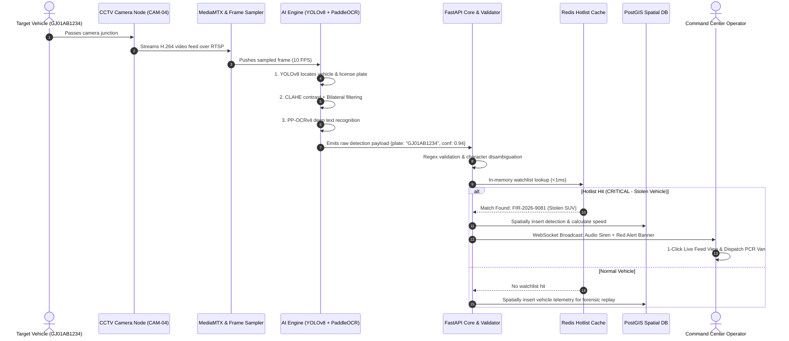

# 🛡️ Sentinel AI Surveillance Platform
## End-to-End Workflow & Integration Specification

**Reference Diagram:** [`02_Workflow_Integration_Diagram.svg`](./02_Workflow_Integration_Diagram.svg)  
**Document Code:** SENTINEL-INT-SPEC-v1.0  
**Target Police Department:** Gujarat Police Command & Control

---

## 1. End-to-End Operational Pipeline

The following sequence illustrates the flow of data from physical vehicle transit to command operator response:



---

## 2. Latency Budget & Timing Benchmarks

| Pipeline Stage | Processing Activity | Average Latency (GPU) | Average Latency (CPU) | Protocol / Method |
| :--- | :--- | :--- | :--- | :--- |
| **Stage 1: Ingestion** | RTSP frame decode & ring-buffering | 35 ms | 50 ms | RTSP / OpenCV / FFmpeg |
| **Stage 2: AI Detection** | YOLOv8 vehicle & plate bounding box | 45 ms | 90 ms | PyTorch / TensorRT |
| **Stage 3: OCR Engine** | CLAHE enhancement + PP-OCRv4 OCR | 65 ms | 120 ms | ONNX / PaddleOCR |
| **Stage 4: Validation** | Indian LP regex & character repair | 2 ms | 3 ms | Compiled Regex |
| **Stage 5: Watchlist Match** | Redis in-memory key-value check | 1 ms | 2 ms | Redis RESP |
| **Stage 6: PostGIS Insert** | Spatial point insertion & trajectory calc | 15 ms | 25 ms | Async SQLAlchemy |
| **Stage 7: UI Alert Push** | Real-time WebSocket event broadcast | 10 ms | 15 ms | WebSockets / JSON |
| **Total Glass-to-Alert** | **Optical sensor to operator siren** | **~173 ms** | **~305 ms** | **Sub-Second Guaranteed** |

---

## 3. Integration Interfaces & Payload Specifications

### 3.1 Live WebSocket Alert Payload (`ws://host:8000/ws/alerts`)
```json
{
  "event_type": "HOTLIST_ALERT",
  "timestamp": "2026-08-31T10:45:22.108Z",
  "camera": {
    "id": "CAM-AHM-04",
    "name": "SG Highway - Pakwan Cross Road",
    "coordinates": {
      "latitude": 23.0338,
      "longitude": 72.5074
    },
    "zone": "Ahmedabad West Zone"
  },
  "detection": {
    "license_plate": "GJ01AB1234",
    "ocr_confidence": 0.948,
    "vehicle_class": "SUV",
    "speed_estimate_kmh": 58.4,
    "plate_crop_url": "/api/v1/media/crops/20260831_GJ01AB1234_crop.jpg",
    "full_frame_url": "/api/v1/media/frames/20260831_GJ01AB1234_full.jpg"
  },
  "hotlist_match": {
    "severity": "CRITICAL",
    "category": "STOLEN_VEHICLE",
    "fir_number": "FIR-2026-9081",
    "police_station": "Vastrapur Police Station",
    "registered_owner": "Maheshbhai Patel",
    "alert_message": "Vehicle reported stolen in armed robbery incident"
  }
}
```

### 3.2 Vehicle Trajectory Query API (`GET /api/v1/vehicles/{plate_number}/trajectory`)
```json
{
  "plate_number": "GJ01AB1234",
  "total_sightings": 4,
  "first_seen": "2026-08-31T09:12:00Z",
  "last_seen": "2026-08-31T10:45:22Z",
  "average_speed_kmh": 52.6,
  "trajectory_geojson": {
    "type": "Feature",
    "geometry": {
      "type": "LineString",
      "coordinates": [
        [72.4981, 23.0125],
        [72.5024, 23.0241],
        [72.5074, 23.0338]
      ]
    },
    "properties": {
      "waypoints": [
        {
          "seq": 1,
          "camera_id": "CAM-AHM-01",
          "name": "Iskcon Cross Road",
          "timestamp": "2026-08-31T09:12:00Z",
          "speed_kmh": 48.0
        },
        {
          "seq": 2,
          "camera_id": "CAM-AHM-02",
          "name": "Sindhu Bhavan Junction",
          "timestamp": "2026-08-31T09:48:15Z",
          "speed_kmh": 55.2
        },
        {
          "seq": 3,
          "camera_id": "CAM-AHM-04",
          "name": "SG Highway - Pakwan Cross Road",
          "timestamp": "2026-08-31T10:45:22Z",
          "speed_kmh": 58.4
        }
      ]
    }
  }
}
```

---

## 4. Integration with External Police Systems

### 4.1 CCTNS (Crime and Criminal Tracking Network & Systems)
- Automated synchronization via nightly batch CSV or real-time REST API webhooks to populate stolen and suspect vehicle hotlists.

### 4.2 Vahan & Sarathi Databases
- Standardized field alignment with MoRTH registration schemas (State, RTO, Series, 4-digit number).

### 4.3 Dial 112 / PCR Dispatch
- Direct webhook trigger dispatches alert notifications with GPS coordinates and fleeing heading to the nearest mobile patrol unit.

---

## 5. Security & Authentication API Specifications

### 5.1 Officer Login & Token Verification
```http
POST /api/v1/auth/login HTTP/1.1
Content-Type: application/json

{
  "email": "jyoti@deventtechnology.com",
  "password": "••••••"
}
```
**Response:**
```json
{
  "id": 1,
  "email": "jyoti@deventtechnology.com",
  "name": "Jyoti (Surveillance Commander)",
  "role": "Superintendent of Police (IT & Cyber)",
  "badge_number": "GP-7829",
  "department": "Gujarat Police Command & Control Centre",
  "token": "sentinel_gp_8a12f7..."
}
```

### 5.2 Dynamic Credential Modification
```http
POST /api/v1/auth/update-credentials HTTP/1.1
Content-Type: application/json

{
  "email": "jyoti@deventtechnology.com",
  "current_password": "old_password",
  "new_password": "new_secure_password"
}
```

---

## 6. Hardware-Accelerated HLS Streaming & On-Demand ANPR

### 6.1 Authenticated Video Proxy Manifest
```http
GET /api/v1/hls/{camera_code}/index.m3u8 HTTP/1.1
Host: sentinel-api-bqfm.onrender.com
```
* Dynamically fetches encrypted chunks from `cctv.corp8.cloud` with Gujarat Police credentials.
* Rewrites encryption key URIs (`/api/v1/hls/{camera_code}/enc.key`) to allow standard HTML5 / `Hls.js` browser playback with GPU hardware acceleration.

### 6.2 On-Demand Real-Time Frame Inference
```http
POST /api/v1/detections/scan-image HTTP/1.1
Content-Type: multipart/form-data

[file: captured_frame.jpg]
[camera_id: 1]
```
**Response:** Runs YOLOv8 vehicle detection + OCR plate recognition on the exact video frame, cross-referencing the plate against the active criminal hotlist and logging forensic spatial coordinates.

